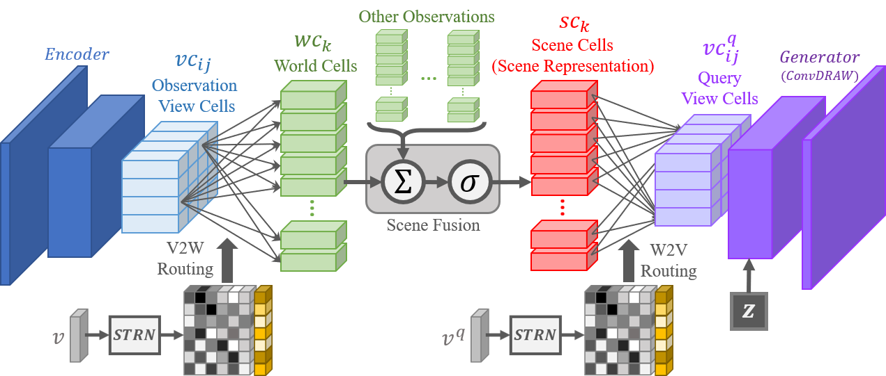

# Spatial-Routing-Generative-Query-Network
This is the official implementation of the paper "STR-GQN: Scene Representation and Rendering for Unknown Cameras Based on Spatial Transformation Routing", ICCV 2021.



## Requirements
- Python >= 3.6
- PyTorch >= 1.6
- PyOpenCV >= 4.4.0
- Tensorflow == 1.13.0 (optional)

## Prepare Dataset
### GQN / E-GQN Dataset
Note: the dataset proposed by E-GQN (RRO, DISCO) is currently not available. 
```
$ cd dataset_handle

# Download Dataset
$ python 01_donwload.py --dataset <dataset-name> --download_path <download-path>

# Convert to Pytorch Data
$ python 02_convert.py --dataset <dataset-name> --download_path <download-path> --convert_path <convert-path> --batch <batch-size>
```
The name of dataset can refer to "info.json". 
Modify the dataset path in the configuration file:
```
# In config\rrc.conf
...
[exp]
data_path = /data/Datasets/GQN-Datasets-pt/rooms_ring_camera/
...
```

### ShapeNet Dataset
1. Download the Shapenet derived datasets from
```
https://www.dropbox.com/s/7fyu2s384w27lo7/all_tfrs.tar?dl=0
```
2. Convert to pytorch format.
```
$ cd datasets_handle/shapenet/
$ python extract_tf_data.py
```

## Training and Evalutation
```
# Training
$ python train_strgqn.py --exp_name <exp-name> --config <config-path> (--shapenet)

# Evaluation
$ python eval_strgqn.py --path <path>
```
if utilize ShapeNet dataset, add "--shapenet".
Some examples:
```
$ python train_strgqn.py --exp_name rrc_test --config config/rrc.conf
$ python evalstrgqn.py --path experiments/2020-11-9_rrc_test
```